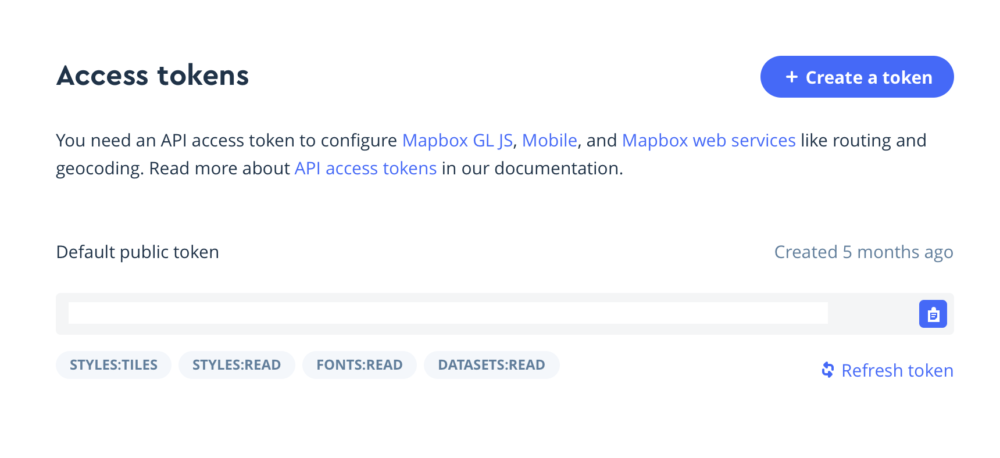
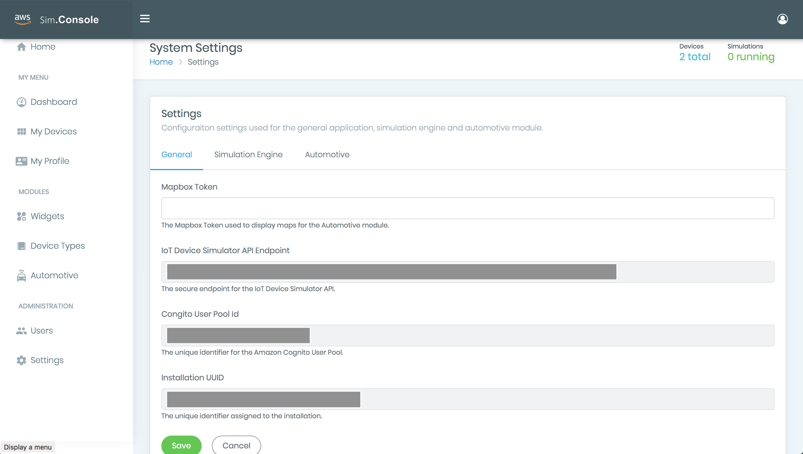

# IoT Simulator Map Box instructions
The following instructions provide a guide on adding the MapBox API to the IoT Simulator.

## Getting the MapBox API Key

 Go to mapbox.com and log in with your account or create an account.

 Once logged into mapbox.com click on *Account*

 Scroll down to Access token and copy the default token.

 

 ## IoT Device Simulator Web Portal Configuration

 Log into the IoT Device Simulator Web Portal

 

Via the left hand menu click on *Settings*

In the *Mapbox Token* Dialog Box copy in the Token from mapbox.com and click Save.

Log out of the console and then back in again for the token to take affect.
