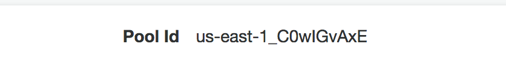

# Overview of Connected Vehicle Reference Architecture API #

There is an API that is included withe the Connected Vehicle Reference Archtitecture.  The API is setup to allow a vehicle owner to access their vehicle's data on the platform.  This is what we will focus on.

The API could be modified, fairly easily, to allow for a number of data access use cases.  If you are interested in exploring these options, you can [find the source code in github](https://github.com/awslabs/aws-connected-vehicle-solution).

## API Structure ##

The API uses the following structure:

* /vehicles
    * /{vin}
        * /anomalies
            * /{anomaly_id}
        * /dtc
            * /{dtc_id}
        * /healthreports
            * /{healthreportid}
        * /trip
            * /{tripid}

All support GET.  /vehicles/{vin}, /anomalies/{anomaly_id}, and /dtc/{dtc_id} support PUT in addition to GET.

More detials on the API can be found in the [Connected Vehicle Reference Architecture documentation](https://docs.aws.amazon.com/solutions/latest/connected-vehicle-solution/appendix.html).

This API, as it is built, is meant to secure the data in the CVRA tables.  As such, users will need to authenticate and have appropriate permissions to perform this task. These steps below will walk through the setup that is needed to setup the authentication and permissions first and then demonstrate the API.

## Setting Up Authentication and Permissions ##

:exclamation: It is important that you do this step *after* starting the IoT Device Simulator to put some vehicle data in the tables.  The tables use VIN as a part of the key and a valid VIN will help provide a better result.

When you are done with these steps, you should have a records in Cognito, and DynamoDB that tie a user to vehicle, similar to this.


1. Get a VIN from your Connected Car Trip Table

a) From the console, navigate to DynamoDB.<br>

b) Click on "Tables" in the Navigation.<br>

c) The Connected Car Trip Table's name begins with "cvra-VehicleTripTable-".  Find this table and click on it.<br>

d) Click on the "Items" tab to display the records in it.<br>

e) Copy any of the VINs from this table.<br>


2. Add an Owner Record

a) Continuing from Step 1, click on the Vehicle Owner Table.  This table begins with "cvra-VehicleOwnerTable-".<br>

b) Click the "Create Item" button.<br>

c) Add in a record using your first name with all lower case letters as the "owner_id" and the VIN from step 1 as the vin.<br>

d) Click "Save".<br>


Your record should now appear in the Items view for your Owners Table.


3. Modify the Cognito User Pool

a) From the console, navigate to "Cognito".<br>

b) Click on "Manage User Pools".<br>

c) Click on "connected_vehicle_user_pool".<br>

d) Copy your "Pool ID" at the top of the page.  You will need this for a later step.<br>

e) Click on "App Clients" on the left hand navigation.<br>

f) Click the "Show Details" button.<br>\

g) Check the "Enable sign-in API for server-based authentication (ADMIN_NO_SRP_AUTH)" box.<br>

h) Copy the "App Client Id" from the page.  You will need this for a later step.<br>
i) Click the "Save app client changes" button.<br>


4. Add Your User

a) Continuing from Step 3, click the "Users and Group" item on the left hand navigation.<br>

b) Click the "Create User" button.<br>

c) Enter your first name in lower case letters for the "Username".  This must match the owner_id from step 2.<br>
d) Uncheck "Send an invitation to this new user?"<br>
e) Enter your "Temporary Password," "Phone Number," and "Email".<br>

f) Click "Create User".<br>


5. Note Your API Gateway URL

a) From the console, select the API Gateway service.<br>

b) Select the "Vehicle Services API".<br>

c) Select "Stages" on the left hand navigation.<br>

d) Click "Prod" underneath the stages.<br>

e) Copy the "Invoke URL," including the /prod.  It should be a value similar to ```https://asdfasfas.execute-api.us-east-1.amazonaws.com/prod```.


At this point we are now ready to use the API that is provided by the Connected Vehicle Reference Architecture.<br>

## Demonstrating API ##

We will be using the command line in your Cloud9 environment

1.  Authenticating

The first step to use the API is to perform authentication steps via the AWS SDK.  In this case, we are going to use the AWS CLI on your Cloud9 instance to simulate what would occur in a mobile or web application.<br>

a) Update following line and put in your user pool id, client id, username, and password to initiate authentication.  Paste it in the terminal window of your Cloud9 instance as a command and press enter.<br>
```1aws cognito-idp admin-initiate-auth --user-pool-id <your_user_pool> --client-id <your_client_id> --auth-flow ADMIN_NO_SRP_AUTH --auth-parameters 'USERNAME=<username>,PASSWORD="<password>"'```<br>

This step allows us to begin the initial login for this user.  You should see a response similar to the following:<br>
```
{
    "ChallengeName": "NEW_PASSWORD_REQUIRED",
    "ChallengeParameters": {
        "USER_ID_FOR_SRP": "tim",
        "requiredAttributes": "[]",
        "userAttributes": "{\"email_verified\":\"true\",\"phone_number_verified\":\"true\",\"phone_number\":\"+15555555555\",\"email\":\"someone@amazon.com\"}"
    },
    "Session": "urGPer5Gr_RCFRW8MYbUHqOxrno-DIKEhJzinvtgNklYLDHueWuT-rSPGWavZG5DgmBnV84yZGcPqfs1Wv_q5a5aaXP-tK2b9V9SVXw4mR-7whgyWHIV_P9ubMNfdY8bIf22RS758ejoH2C3aZDUIAMD-QbhGrBOfsCS5aOWru_Vc47kMZaIg1xuJZQ-JtX48ECa_wGM7r4vU3oYu4YXGgc78Gfnv_Fdjstv7DVeYzJL-y93ohm19Kub3AmHa3AmmWKfCQBrNcK__DxN6ED5bCPVVRqd0VzPcJhrhV6ugZplpFwOf9bHLJoUpKxW53AVRRaU_FK3snSllp52d4uhHtM_RsLQNxhiWx4VfHq-bUBUrel1AHubdN2RrQU1_iOUMQTASLjt5ZkrWDZNK9fTzBVW8lZTGmn2nj3xwp_HvbuBHkLIHW4JAfvPhQ9Yaxb133YAFlf3ARDI9KYNWwvWwrisMWxPUPYTA8mn46ZgwdpuOa_t_QHAwY-rDU_BJMgOyny7EgMxQPU57z-C2d24Qd-AmiFiyvZ9P-SBoUCWJxWH8_sov8MCDwG1wixfkbndUxkv1JjwOj4kwCSv2uvzO4ojxvZYPVzJWN9tUsOw7mPYCCWUX5qVE8PbwSA5XE20SBQu-ZPQfJK6kqihQcybWpIwch9L8rdH4LBPIUwDs1ukdjhbTyEae7P209JHc6kkqG2yQpmDS-51IbdP6aaAjFLtpcxEkOpXnZjYIa5l_9eVHTs6-077VUpcowsq2rW4OFOfb_fFwnz-R08I4ZHazwX_CV43PXsg1nOCbSaftnbawkv3lbBKNCfvYJ5Negs_n97QIw"
}
```

Note the ChallengeName calls out that a New Password is required.  To finish the authentication step, we must submit a change password response to this.<br>

:hand: If you received this response, please copy your session value and continue to step b below.<br>

If this had been a successful authentication without a challenge, we would have received a response like this:<br>
```{
    "AuthenticationResult": {
        "ExpiresIn": 3600,
        "IdToken": "eyJraWQiOiJqUHpGNzV2RnB3RzBqNkVXYlJtUUtFV2VcL2Urak54YTQ1R2dEUlNKM3ZcL2c9IiwiYWxnIjoiUlMyNTYifQ.eyJzdWIiOiIwOTU3MDBhMy1kOWE2LTRiYmQtODEyMi02M2NhOWZhMGY2YzIiLCJlbWFpbF92ZXJpZmllZCI6dHJ1ZSwiaXNzIjoiaHR0cHM6XC9cL2NvZ25pdG8taWRwLnVzLWVhc3QtMS5hbWF6b25hd3MuY29tXC91cy1lYXN0LTFfQzB3SUd2QXhFIiwicGhvbmVfbnVtYmVyX3ZlcmlmaWVkIjp0cnVlLCJjb2duaXRvOnVzZXJuYW1lIjoidGltIiwiYXVkIjoiMXEwb3Jkc2ljcmk5ZTV2cmRhb3NsYWd0MnYiLCJldmVudF9pZCI6IjcwNGY5ZWJmLTI4YWQtMTFlOS1hM2M2LWVmMWNlMjM3YzA5NSIsInRva2VuX3VzZSI6ImlkIiwiYXV0aF90aW1lIjoxNTQ5MzA2MDk5LCJwaG9uZV9udW1iZXIiOiIrMTI0ODcyMjE0MTciLCJleHAiOjE1NDkzMDk2OTksImlhdCI6MTU0OTMwNjA5OSwiZW1haWwiOiJicnVjZXRpbUBhbWF6b24uY29tIn0.kXptMdTPm0hYDyM4BPlz_pTT9RV7W7LP8eFepZtsuzUoPO1pbIZRisnzW9gui2rJV31gYCoOPOYKD0WZ6zRLcZwcNwRkYwZBk6x2l8XKlTYKHt2r_C4uLMOTTH_CpRVufiW0r14E58mmTkWtdzpsZmlfjfvjFXqb3VDs0v-xelyCpqLnZdmZvQrEwPEHxce3R2eTeEB6m5SidgIdoMZiC6C_CpAWZjWXx7J9m_cq6Fkd-Rj04HBObqwGXGhfJC1x2ABE9bPhfgsW0645yb-cDDu6Alt3dWt8aYnR0A9UzXLBQkEt-gtRh96tFkSGLq3yH6C9VirHkzdkT5_TLMzrKw",
        "RefreshToken": "eyJjdHkiOiJKV1QiLCJlbmMiOiJBMjU2R0NNIiwiYWxnIjoiUlNBLU9BRVAifQ.LwrbNydVbzND0SRmeBNMwfzUENGORWCTXkQ8yQFAyCsK5jHQGudpTf8D0vSGMOw0bsOGg48_Kxf9ct6ug8JFD82GxoLXv5xQrovFAtTOu1H1i30KLg9Nye0lR7ZFa9AdDiclZ06O9rn3WaEanHtYK777RI0ok65L7w6CqFqRRlyFQSBUUKwRQ-Q0QoD4EQUKvnuP1WV_p4P6TIokN6W4phSvEbqWUXmLgk5FRjQd8YiVsO3Xr208-j4HDwIbh8wVkhoerRTlNIzDBF7tvdwmCRZKB1AVGn6PcLPsQB-2xXstERGLmAiK1mQN7gXaoVFg8MXDG-4rKcoQzZYFkIkMXA.sWmEFG4KmXngsmZu.X3wmFOzkI6zw574fMgHlqvlHQCM60ugnWcor72EsEIQkMHN3LP1oZleP_kBFr2FWfi84mrJuaQ7eWPLAsrtVWHkq-ogK6Nt6u0y_ThAuP4O9TN9ZBWVpxCeDWPzTQZD8D_jYeOOaNwBQ8gYDAFBu5wOO2y_0zZUbmjZMf-fFBOkdng1EXa2ws7osozlGcdAjSbGg3bS3aRswV_1DUoUeR1YLnblCcgtR4abGhe7M8CtJC-uO9vdx8b3LDVO3e9ram8V8bIkRa_vYIrhzLiwK1k1R4Xktp5SExS49cRXMlTMqI3bDYHG_OZAvPg76hUhTcbexaExSV2J6EV2v5YSkVHhOjprdeFYhxKUEEKczYi90O7UHF0nyBgGL5YEuDNZgbfRzzrX9nMLluexF9K2RyKzgWvGKYkIklCC5yIrlhCuqflKq-RJsr6uZsDxN3GTeUoBYi3QIqwUdUWRpYdyuxoxMnGXABYdoGGXSHy-HpvrbWalPegV9Zy68EAjBtzmwsJtREyo2P2bB6i4Adm43aT-5oxFR6ukPRYfX0WcESt4Z92wwOPVcSdXAN8fB2dg4ACBa-vPBaZJd379s1ukPMa2ETe8g4GCa_7hHtWsb1grTrdnRMriw7lufYSlJhia_vbkpG5VGVR00kNsz8dNi9akjmocaXoKnBtjb9K2tVZo99g7sgvqW50YstbEBwuTOhyUNfUWmF8nEDltE21gI_ynDKvuUJjwFRu478RA0zjlXeinnmHPVBFUJCBu5DR8ZrwuXgr1pa4nr3-g9k-weFPCy2l4EmGNomgqChruvaksDdxmjBxrRqGYQQW57_WnMM2QY_wG-htVeBUdDYcASzPw5WRgw0q3RWcyK6DGJoJcizh9M39r7EFNYUzF8aYisS-G4pDcgEoGEILtr-OAgd7bOhnIIkgtywtJui3oxi7KwrS4VFVyK22fRd67EF-8yjFYBNaOF106qX1kTle-pxmRV53oUMfTf7THr1RS2Yh3eXi15S3kjQFUxNLczWn7m0Rt_N2Ys4ui49EM1QQBXa0ZIibkwDld5qKFujLTcmAineOXdSowa6Pok2nZHzhqx5Uv4aJehh1T4NWIbL46OAzOIbj6Sx22g0yp_qQIWpEqFVGRCZJD6ZSOngP2wBpuQmfIzjNlJEuMAlzMIMtAH02Z08Ya-bXv9pDkJiLCXxTDTkvreYI0oJAiC3qWDOE2nn8QAw-unnX9k3Inz8SMIomjXDEEt2j45Qvw0EkDhf3OooY8HU9Ws3x8NTdVyhcwl.NaqihbN-mxFbbqJUfc8aLQ",
        "TokenType": "Bearer",
        "AccessToken": "eyJraWQiOiJsclE4SjRIYmJIdXRDSE9ncFdneE9uODJKb1VpKzJPYTZkZHV5cVJ5YUM4PSIsImFsZyI6IlJTMjU2In0.eyJzdWIiOiIwOTU3MDBhMy1kOWE2LTRiYmQtODEyMi02M2NhOWZhMGY2YzIiLCJldmVudF9pZCI6IjcwNGY5ZWJmLTI4YWQtMTFlOS1hM2M2LWVmMWNlMjM3YzA5NSIsInRva2VuX3VzZSI6ImFjY2VzcyIsInNjb3BlIjoiYXdzLmNvZ25pdG8uc2lnbmluLnVzZXIuYWRtaW4iLCJhdXRoX3RpbWUiOjE1NDkzMDYwOTksImlzcyI6Imh0dHBzOlwvXC9jb2duaXRvLWlkcC51cy1lYXN0LTEuYW1hem9uYXdzLmNvbVwvdXMtZWFzdC0xX0Mwd0lHdkF4RSIsImV4cCI6MTU0OTMwOTY5OSwiaWF0IjoxNTQ5MzA2MDk5LCJqdGkiOiI5YmU2NzQwMy1mNjE2LTRjYWYtODY2Ny01ZWE3OTQyY2NiZmMiLCJjbGllbnRfaWQiOiIxcTBvcmRzaWNyaTllNXZyZGFvc2xhZ3QydiIsInVzZXJuYW1lIjoidGltIn0.VLtMSClakPcCqKCEPnz_MknFTMO4n9xFll2Ho1tTWpO6tbU6SxgcmtuzaZjI66j9VrLoz2x0_718BAtCYmE8dKxN5W0m0bnOb8IpQ0dONMyhzaAQ9ip5dtyL-gUZ1rNGS21g8hNLzTZJHt2KI4Q_8IsOsCq0AwkNQeJR0zLSqb9hXLNVV2YOwUfyDHgPRNynknZenSskwnlv3JWOpffagH4eLDWfWwhpIbzjbZdEfodpnqWmh0HdhqzUxPr1mZN44m8VUaAz6Xzs6hm2s0WpR1XeCZQmj3cs8YFRxVeZXYASGGYBVfHmQ71enHicOxUO0nfjpJQQoiF6efILBj6KIA"
    },
    "ChallengeParameters": {}
}
```

:hand: If you received this response, please copy your IDToken from the response and proceed to step c below.</br>

b. Update the following line to respond to the Change Password challenge and completing authentication.  Paste it into your Cloud9 terminal session as a command and press enter.</br>
```aws cognito-idp admin-respond-to-auth-challenge --user-pool-id <your_pool_id> --client-id <your_client_id> --challenge-name NEW_PASSWORD_REQUIRED --challenge-response 'USERNAME=<your_user_id>,NEW_PASSWORD=<newpassword>' --session '<your_session_id>'```<br>

This command should then return a response such as this, if successfully run:<br>
```{
    "AuthenticationResult": {
        "ExpiresIn": 3600,
        "IdToken": "eyJraWQiOiJqUHpGNzV2RnB3RzBqNkVXYlJtUUtFV2VcL2Urak54YTQ1R2dEUlNKM3ZcL2c9IiwiYWxnIjoiUlMyNTYifQ.eyJzdWIiOiIwOTU3MDBhMy1kOWE2LTRiYmQtODEyMi02M2NhOWZhMGY2YzIiLCJlbWFpbF92ZXJpZmllZCI6dHJ1ZSwiaXNzIjoiaHR0cHM6XC9cL2NvZ25pdG8taWRwLnVzLWVhc3QtMS5hbWF6b25hd3MuY29tXC91cy1lYXN0LTFfQzB3SUd2QXhFIiwicGhvbmVfbnVtYmVyX3ZlcmlmaWVkIjp0cnVlLCJjb2duaXRvOnVzZXJuYW1lIjoidGltIiwiYXVkIjoiMXEwb3Jkc2ljcmk5ZTV2cmRhb3NsYWd0MnYiLCJldmVudF9pZCI6IjcwNGY5ZWJmLTI4YWQtMTFlOS1hM2M2LWVmMWNlMjM3YzA5NSIsInRva2VuX3VzZSI6ImlkIiwiYXV0aF90aW1lIjoxNTQ5MzA2MDk5LCJwaG9uZV9udW1iZXIiOiIrMTI0ODcyMjE0MTciLCJleHAiOjE1NDkzMDk2OTksImlhdCI6MTU0OTMwNjA5OSwiZW1haWwiOiJicnVjZXRpbUBhbWF6b24uY29tIn0.kXptMdTPm0hYDyM4BPlz_pTT9RV7W7LP8eFepZtsuzUoPO1pbIZRisnzW9gui2rJV31gYCoOPOYKD0WZ6zRLcZwcNwRkYwZBk6x2l8XKlTYKHt2r_C4uLMOTTH_CpRVufiW0r14E58mmTkWtdzpsZmlfjfvjFXqb3VDs0v-xelyCpqLnZdmZvQrEwPEHxce3R2eTeEB6m5SidgIdoMZiC6C_CpAWZjWXx7J9m_cq6Fkd-Rj04HBObqwGXGhfJC1x2ABE9bPhfgsW0645yb-cDDu6Alt3dWt8aYnR0A9UzXLBQkEt-gtRh96tFkSGLq3yH6C9VirHkzdkT5_TLMzrKw",
        "RefreshToken": "eyJjdHkiOiJKV1QiLCJlbmMiOiJBMjU2R0NNIiwiYWxnIjoiUlNBLU9BRVAifQ.LwrbNydVbzND0SRmeBNMwfzUENGORWCTXkQ8yQFAyCsK5jHQGudpTf8D0vSGMOw0bsOGg48_Kxf9ct6ug8JFD82GxoLXv5xQrovFAtTOu1H1i30KLg9Nye0lR7ZFa9AdDiclZ06O9rn3WaEanHtYK777RI0ok65L7w6CqFqRRlyFQSBUUKwRQ-Q0QoD4EQUKvnuP1WV_p4P6TIokN6W4phSvEbqWUXmLgk5FRjQd8YiVsO3Xr208-j4HDwIbh8wVkhoerRTlNIzDBF7tvdwmCRZKB1AVGn6PcLPsQB-2xXstERGLmAiK1mQN7gXaoVFg8MXDG-4rKcoQzZYFkIkMXA.sWmEFG4KmXngsmZu.X3wmFOzkI6zw574fMgHlqvlHQCM60ugnWcor72EsEIQkMHN3LP1oZleP_kBFr2FWfi84mrJuaQ7eWPLAsrtVWHkq-ogK6Nt6u0y_ThAuP4O9TN9ZBWVpxCeDWPzTQZD8D_jYeOOaNwBQ8gYDAFBu5wOO2y_0zZUbmjZMf-fFBOkdng1EXa2ws7osozlGcdAjSbGg3bS3aRswV_1DUoUeR1YLnblCcgtR4abGhe7M8CtJC-uO9vdx8b3LDVO3e9ram8V8bIkRa_vYIrhzLiwK1k1R4Xktp5SExS49cRXMlTMqI3bDYHG_OZAvPg76hUhTcbexaExSV2J6EV2v5YSkVHhOjprdeFYhxKUEEKczYi90O7UHF0nyBgGL5YEuDNZgbfRzzrX9nMLluexF9K2RyKzgWvGKYkIklCC5yIrlhCuqflKq-RJsr6uZsDxN3GTeUoBYi3QIqwUdUWRpYdyuxoxMnGXABYdoGGXSHy-HpvrbWalPegV9Zy68EAjBtzmwsJtREyo2P2bB6i4Adm43aT-5oxFR6ukPRYfX0WcESt4Z92wwOPVcSdXAN8fB2dg4ACBa-vPBaZJd379s1ukPMa2ETe8g4GCa_7hHtWsb1grTrdnRMriw7lufYSlJhia_vbkpG5VGVR00kNsz8dNi9akjmocaXoKnBtjb9K2tVZo99g7sgvqW50YstbEBwuTOhyUNfUWmF8nEDltE21gI_ynDKvuUJjwFRu478RA0zjlXeinnmHPVBFUJCBu5DR8ZrwuXgr1pa4nr3-g9k-weFPCy2l4EmGNomgqChruvaksDdxmjBxrRqGYQQW57_WnMM2QY_wG-htVeBUdDYcASzPw5WRgw0q3RWcyK6DGJoJcizh9M39r7EFNYUzF8aYisS-G4pDcgEoGEILtr-OAgd7bOhnIIkgtywtJui3oxi7KwrS4VFVyK22fRd67EF-8yjFYBNaOF106qX1kTle-pxmRV53oUMfTf7THr1RS2Yh3eXi15S3kjQFUxNLczWn7m0Rt_N2Ys4ui49EM1QQBXa0ZIibkwDld5qKFujLTcmAineOXdSowa6Pok2nZHzhqx5Uv4aJehh1T4NWIbL46OAzOIbj6Sx22g0yp_qQIWpEqFVGRCZJD6ZSOngP2wBpuQmfIzjNlJEuMAlzMIMtAH02Z08Ya-bXv9pDkJiLCXxTDTkvreYI0oJAiC3qWDOE2nn8QAw-unnX9k3Inz8SMIomjXDEEt2j45Qvw0EkDhf3OooY8HU9Ws3x8NTdVyhcwl.NaqihbN-mxFbbqJUfc8aLQ",
        "TokenType": "Bearer",
        "AccessToken": "eyJraWQiOiJsclE4SjRIYmJIdXRDSE9ncFdneE9uODJKb1VpKzJPYTZkZHV5cVJ5YUM4PSIsImFsZyI6IlJTMjU2In0.eyJzdWIiOiIwOTU3MDBhMy1kOWE2LTRiYmQtODEyMi02M2NhOWZhMGY2YzIiLCJldmVudF9pZCI6IjcwNGY5ZWJmLTI4YWQtMTFlOS1hM2M2LWVmMWNlMjM3YzA5NSIsInRva2VuX3VzZSI6ImFjY2VzcyIsInNjb3BlIjoiYXdzLmNvZ25pdG8uc2lnbmluLnVzZXIuYWRtaW4iLCJhdXRoX3RpbWUiOjE1NDkzMDYwOTksImlzcyI6Imh0dHBzOlwvXC9jb2duaXRvLWlkcC51cy1lYXN0LTEuYW1hem9uYXdzLmNvbVwvdXMtZWFzdC0xX0Mwd0lHdkF4RSIsImV4cCI6MTU0OTMwOTY5OSwiaWF0IjoxNTQ5MzA2MDk5LCJqdGkiOiI5YmU2NzQwMy1mNjE2LTRjYWYtODY2Ny01ZWE3OTQyY2NiZmMiLCJjbGllbnRfaWQiOiIxcTBvcmRzaWNyaTllNXZyZGFvc2xhZ3QydiIsInVzZXJuYW1lIjoidGltIn0.VLtMSClakPcCqKCEPnz_MknFTMO4n9xFll2Ho1tTWpO6tbU6SxgcmtuzaZjI66j9VrLoz2x0_718BAtCYmE8dKxN5W0m0bnOb8IpQ0dONMyhzaAQ9ip5dtyL-gUZ1rNGS21g8hNLzTZJHt2KI4Q_8IsOsCq0AwkNQeJR0zLSqb9hXLNVV2YOwUfyDHgPRNynknZenSskwnlv3JWOpffagH4eLDWfWwhpIbzjbZdEfodpnqWmh0HdhqzUxPr1mZN44m8VUaAz6Xzs6hm2s0WpR1XeCZQmj3cs8YFRxVeZXYASGGYBVfHmQ71enHicOxUO0nfjpJQQoiF6efILBj6KIA"
    },
    "ChallengeParameters": {}
}
```

Copy the IdToken value for future commands.

c. Make calls to the API using CURL

With the data we just received, we can successfully make calls to the API using the Invoke URL from above and the IdToken value.  Modify the following command to include your IdToken and Invoke URL, paste it into the terminal window and press Enter.<br>

```curl -H "Authorization : <your_IdToken>" <your_invoke_url>/vehicles```<br>
