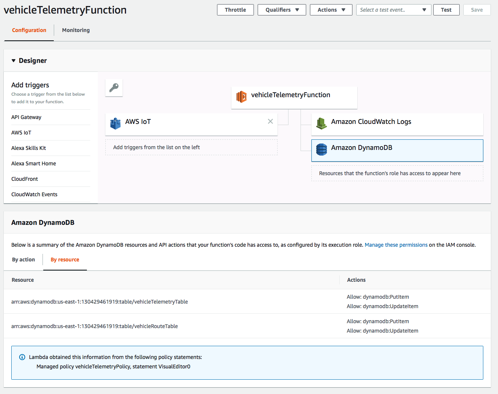
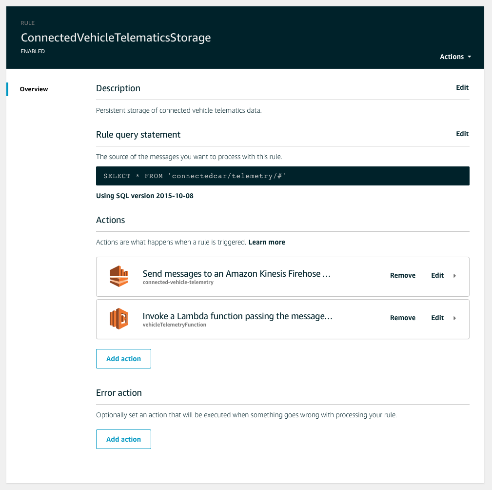
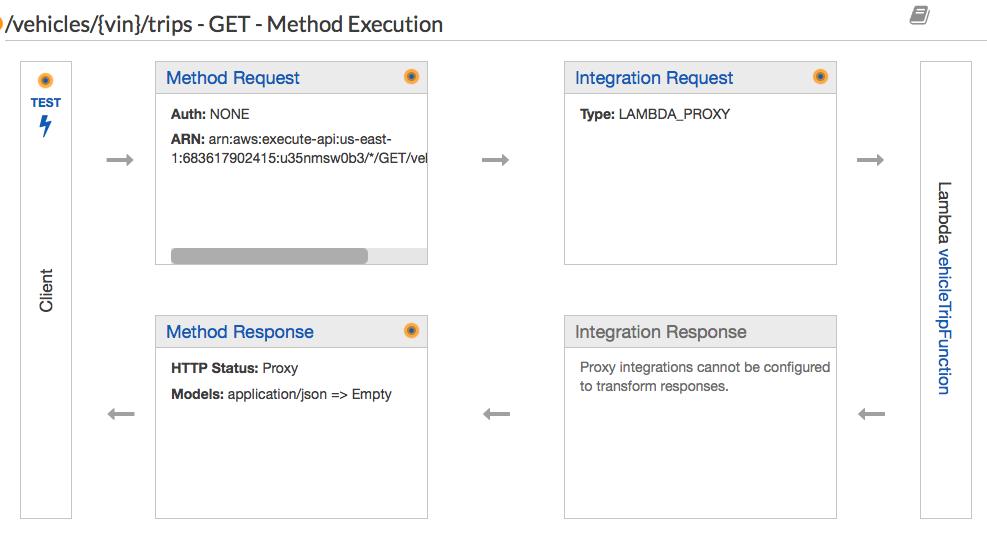
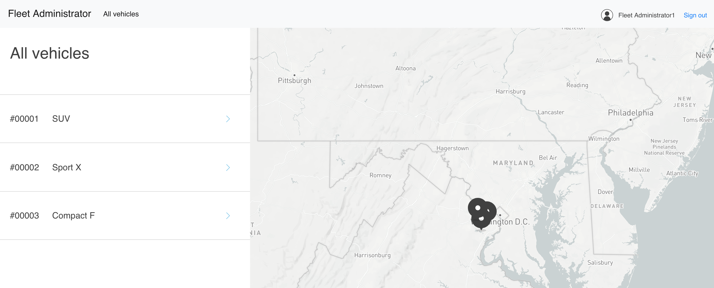

# Overview
In this part of the workshop we will build the additional components on-top of the CVRA to store trip route data and the latest telemetry data and provide a Fleet Admin dashboard to view it.

## Create DynamoDB Tables, a Lambda Function and update the IoT Rule
The following steps will guide you through creating two new DynamoDB tables, a Lambda function with the required IAM Role and Policy. Then we will update an IoT rule created by the CVRA CloudFormation template to store trip telemetry and route data into the new tables.

### Create the DynamoDB tables.
From the AWS Console create 2 new DynamoDB tables in the **US-EAST-1** region using the below setting, keep all other setting as default.

- Table Name **vehicleTelemetryTable** Primary Key **vin** type **string**
- Table Name **vehicleRouteTable** Primary Key **trip_id** type **string**

### Create a new Lamdba Function with the required permissions

1. Create a new **IAM Role** for a Lambda function, the *Role* for the Lambda function will need access to add and update items in the two new DynamoDB tables.

You can use the below policy if required for the role.

```json
  {
      "Version": "2012-10-17",
      "Statement": [
          {
              "Effect": "Allow",
              "Action": [
                  "dynamodb:PutItem",
                  "dynamodb:UpdateItem"
              ],
              "Resource": [
                  "arn:aws:dynamodb:<REGION>:<ACCOUNT_ID>:table/vehicleTelemetryTable",
                  "arn:aws:dynamodb:<REGION>:<ACCOUNT_ID>:table/vehicleRouteTable"
              ]
          }
      ]
  }
  ```
> Make sure you replace REGION and ACCOUNT_ID with your relevant information.


2. Create a new Lambda Function using Node.js version 8.10 and the role you just created for the permissions.



Copy and paste the below code into the Function, please make sure that if you have used different DynamoDB table names you update the code to reflect the correct names. Keep all other Lambda settings as default.

```javascript
//Initiate
'use strict';
console.log('Loading function');
const aws = require('aws-sdk');
aws.config.update({region: 'us-east-1'});
const docClient = new aws.DynamoDB.DocumentClient({apiVersion: '2012-08-10'});

exports.handler = (event, context, callback) => {
    // Uncomment the below line if you want to see the Telemetry payload in the CloudWatch Logs.
    //console.log(JSON.stringify(event, null, 2));
    // Set the variables
    var vin_val = event['vin'];
    var last_update_val = event['timestamp'];
    var trip_id_val = event['trip_id'];
    var attr_name = event['name'];
    var attr_val = event['value'];
    //If the attribute is location combine lat and long
    if (attr_name == "location" ){
        var attr_val = [event['latitude'],event['longitude']];
    }
    // Set the table name
    var table = "vehicleTelemetryTable";
    // Define the update expresssion for the DDB table
    var updexp = "set last_updated=:lu, trip_id=:ti, #attrName=:an";
    var params = {
        TableName:table,
        Key:{
            "vin": vin_val
        },
        UpdateExpression: updexp,
        ExpressionAttributeNames: {
            "#attrName" : attr_name
        },
        ExpressionAttributeValues: {
            ":lu":last_update_val,
            ":ti":trip_id_val,
            ":an":attr_val
        },
        ReturnValues:"UPDATED_NEW"
    };
    //Execute the DDB update
    docClient.update(params, function(err, data) {
        if (err) {
            console.error("Unable to update item. Error JSON:", JSON.stringify(err, null, 2));
        } else {
            console.log("UpdateItem succeeded:", JSON.stringify(data, null, 2));
        }
    });
    //Store the GPS Location in the Route Table
    if (attr_name == "location" ){
      // Set the table name
      var table = "vehicleRouteTable";
      // Define the update expression
      // If the Route entry does not exist then create it.
      var updexp = "set #rt = list_append(if_not_exists(#rt, :empty_list), :rt)";
      var params = {
        TableName:table,
        Key:{
          "trip_id": trip_id_val
        },
        UpdateExpression: updexp,
        ExpressionAttributeNames: {
            "#rt": "route"
        },
        ExpressionAttributeValues: {
          ":rt": [attr_val],
          ":empty_list": []
        },
        ReturnValues:"UPDATED_NEW"
      };
      // Execute the DDB update
      docClient.update(params, function(err, data) {
          if (err) {
              console.error("Unable to update route. Error JSON:", JSON.stringify(err, null, 2));
          } else {
              console.log("Update Route Successfully:", JSON.stringify(data, null, 2));
          }
      });
    }
};
```

Make sure you click **Save** on the Lambda function.

3. Once the Function is created add it as an action to the IoT **ConnectedVehicleTelematicsStorage** rule. This can be done either via the Lambda Function by adding IoT as a trigger or via the IoT Service Console window and clicking on Act.



## Run some vehicle simulations

It will take some minutes for the trip simulations to complete so lets start the simulations and then we can deploy the Fleet Management portal.

Log into the IoT Device Simulator using the credentials and instructions you got in the Email generated by the IoT Device Simulator CloudFormation template deployment.

*If this is your first login to the simulator you will need to set your password, just follow the instructions on the website.*

1. Click on "Settings" in the left hand menu and input your Mapbox API token into the dialog box and click Save (if you have not already done this).
2. Click on "Automotive" on the left hand menu.
3. Click on "+ Add Vehicle"
4. Choose 5 and click submit

The simulator will now run 5 route simulations.

You can either click **view** on the Simulator website to see the telemetry data being sent or in the AWS Console go to **IoT Core** and click on **Test** and subscribe to the connectedcar/telemetry/# topic.

Additionally you can look at the DynamoDB tables created above to ensure data is being populated.

## Create a new Trip API Service

1. Download the attached [Trip Function CloudFormation Template](trip-function-cfm.yaml) and deploy it into your account. As part of the stack deployment you will need to reference the trip and route DynamoDB tables so please make a note of them before deploying the stack.

*Note that the above CloudFormation template also deploys a S3 Bucket which will host the Fleet Admin Portal*

2. In the console go to the API Gateway Service and select the **Vehicle Services API** service. Under **trips** in Resources you will need to delete the **GET** Methods for /trips and /{trip_id} and re-create them with the new Lambda function that was created with the above CloudFormation template.




3. Once done, then from the Resources Action drop down menu, deploy the API to the prod stage.

## Cognito Configuration

In this section we will use the Cognito setup deployed within the CVRA and extend it to support the Fleet Admin Portal.

1. Deploy the following CloudFormation template to add a fleet-admin group and to create a user [Cognito CloudFormation Template](cognito.yaml)

When deploying the stack you will need to enter your Email Address to ensure you get the password for the fleet.admin user.

3. From the AWS Console, select the Cognito Service and then click on the **connected-vehicle-user-pool** user pool.

4. Select **App client** under the General settings in Cognito, click **Show Details** and change the **Refresh token expiration** to 30.

5. Select **Domain Name** under App integration and create a new custom domain (I used my AWS_ACCOUNT_ID), check its availability and save the changes.

6. Go to the CloudFront Service in the console and create a new Web distribution.
 - The **Origin Domain Name** should be the S3 bucket that was created above.
 - The **Default Root Object** should be index.html.
 - The **Origin ID** can be fleetmgtui
 - **Viewer Protocol Policy** should be Redirect HTTP to HTTPS
 - **Query String Forwarding and Caching** should be Forward all, cache based on all
 - **Object Caching** should be set to Customized with a **Default TTL** of 5

It will take a while for the CloudFront distribution to deploy, while this is happening we can build the web site. Before you move to the next step take a note of the CloudFront domain name.

7. Back in Cognito, select **App client settings** under the connected-vehicle-user-pool.
 - Ensure Select all and Cognito User Pool is ticked.
 - Put the CloudFront domain name in the **Callback URL(s)** and **Sign out URL(s)** dialog box, make sure you add **https://** in front of the URL within the dialog box.
 - Tick Implicit grant, openid, profile and aws.cognito.signin.user.admin

## Building the Web UI

For this step you will need Node.js (npm) installed on your laptop, if you do not have it installed you can follow these [instructions](https://www.npmjs.com/get-npm) to install it.

You will also need the awscli setup to access your account.

1. Download the source code for the Fleet Management Portal to your laptop and uncompress the [Zip File](https://s3.amazonaws.com/cvra-deepdrive-us-east-1-683617902415/web-ui.zip)

2. Change Directory (cd) into the uncompressed zip file directory.

`$ cd web-ui`

3. Create a file called ***config.json*** in the ***src/assets*** directory and populate it with the below JSON and ensure you enter your specifics as the values.

```json
{
  "AWS_ACCOUNT_ID":"",
  "AWS_REGION":"",
  "USER_POOL_ID":"",
  "USER_POOL_CLIENT_ID":"",
  "IDENTITY_POOL_ID":"",
  "COGNITO_CUSTOM_DOMAIN":"",
  "IOT_ENDPOINT":"",
  "MAPBOX_API_TOKEN":""
}
```
An example of what the file should look like is below:
```json
{
  "AWS_ACCOUNT_ID":"683617902415",
  "AWS_REGION":"us-east-1",
  "USER_POOL_ID":"us-east-1_PVS4Ll5de",
  "USER_POOL_CLIENT_ID":"be2dbsi4dcukksoold8s6454q",
  "IDENTITY_POOL_ID":"us-east-1:d9263cf5-bbbc-4fbe-826c-b465f59a36fa",
  "COGNITO_CUSTOM_DOMAIN":"683617902415",
  "IOT_ENDPOINT":"a3nez6ylijpipt.iot.us-east-1.amazonaws.com",
  "MAPBOX_API_TOKEN":"pk.eyJ1Ijoic3RldmJsYSIsImEiOiJjamk5cTlsd2swd3plM2twMGxqZWRha2VmIn0.DeYYrRLsYmk90Mf7EiIo-A"
}
```
4. From the web-ui directory run npm install

`$ npm install`

5. Next we will build the API sdk, run the below commands via your terminal / command line.

> Note. make sure you default region is set to US-EAST-1 (aws configure set region us-east-1)

```bash
all_apis=$(aws apigateway get-rest-apis)
vehicle_api_id=$(echo $all_apis | jq -r '.items[] | select(.name == "Vehicle Services API") | .id')
mkdir -p lib/vehicle-api
bash scripts/build.sh $vehicle_api_id
```

6. Now run the npm build command.

`$ npm run build`

7. Finally lets copy the website code to your S3 hosting bucket by running the below commands. The commands should be run from the web-ui directory and ensure that the $WEBSITE_BUCKET name is correct for your environment.

```bash
cp -R dist/* output/

export WEBSITE_BUCKET=fleetmgtui-us-east-1-<AWS_ACCOUNT_ID>

aws s3 cp --acl public-read output/index.html s3://${WEBSITE_BUCKET}/index.html
aws s3 cp --acl public-read --recursive output/static s3://${WEBSITE_BUCKET}/static
```

## Creating the vehicleTable.

Before re:Invent this step will be automated.

1. Create a new DynamoDB table called vehilceTable with a primary key called vin.
2. Via the IoT Simulator Automotive page make a note of the Vehicle VIN numbers.
3. For each VIN within the IoT Simulator you will need to make a new entry into the vehicleTable with the following String Items.
 - modelName
 - vehicleId
 - vin

The modelName can be anything you like for example "Yellow Car" or "Sports X" and the vehicleId has to be a unique 5 digit number.

## Accessing the Fleet Management Portal.

The CloudFront distribution will take a little while to deploy, so if its still deploying please move onto the Alexa Skill part and come back to viewing the portal once the deployment has completed.

Browse to the CloudFront domain name created earlier (dasd789sdfa.cloudfront.net for example) and use the fleet.admin User you created earlier on to log-in.

Once logged in you should see a dashboard simular to the below image.


