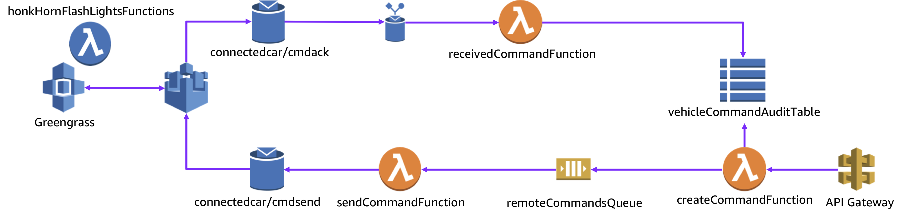

# Overview
This part of the lab you will simulate a vehicle executing remote commands to flash its lights.

The lab will utilise a EC2 instance running Greengrass to simulate the vehicle.

The below diagram shows the architecture of what you will create in this section.



For the lab you will need to use the below JSON payload as the input into the Lambda function to simulate the remote command. Input a VIN number from the IoT Simulator into the payload and update the timestamp

```json
{
"cmd": 10,
"vin" : “input vin here”,
"args" : [],
"timestamp" : "YYYY-MM-DD HH:mm:SS.mmmmmm"
}
```

## Car Simulator

For the simulation of the car, we will deploy the below CloudFormation template which will give you an EC2 instance with Greengrass installed and a Cloud9 interface.

[CloudFormation Greengrass Template](cfn-gg-vehicle.json)

### Remote Command Audit table.
Create a new DynamoDB table called **vehicleCommandAuditTable** with a Primary Key called **vin** type **string** and a sort key called **exe_id** type String.

### SQS remoteCommands queue
Create a new standard SQS Queue, call the queue **remoteCommandsQueue**

### createCommand Lambda Function
Create a new Lambda function called **createCommandFunction** with Node.js and a role called **createCommandRole** with a policy.

The function will need to take the input JSON payload write the details to the **vehicleCommandAuditTable** DynamoDB table with a generated UUID as a exe_id and send the payload to the SQS **remoteCommandsQueue** queue.

### sendCommand Lambda Function
Create a new function called **sendCommandFunction** with Node.js with a custom role **sendCommandRole**.

Select SQS as the event source with the **remoteCommandsQueue** as the SQS queue and a batch size of 1

The Function will need to take the SQS event and send a message to IoT topic **connectedcar/cmdsend**

### Deploy a Vehicle
Deploy the attached CloudFormation template.

Once deployed log into the Cloud9 web page.

From the AWS Console open AWS IoT and Choose Greengrass and then select "Get Started".

Click "Use easy creation" give the Group a name, like vehiclesim and accept the default name for the Core.

Click "Create Group and Core"

Download the resources.zip file and click Finish.

Via the Cloud9 console, upload the downloaded setup.tar.gz file.
run the following command

```
sudo tar -xvzf GUID-setup.tar.gz -C /greengrass
```
Run following commands to start the GG
```
cd /greengrass/ggc/core
sudo ./greengrassd start
```

### Creating the lambda function
Download the AWS Greengrass Core SDK, copy it to a working directory of your choice and Expand/Uncompress the file.

Create a new file called flashLightsHonkHorn.py which will be part of the Lambda function.

Create a new file called flashLightsHonkHorn.py using the following code as a template.

```python
import greengrasssdk
import uuid
import time
client = greengrasssdk.client('iot-data')
flashFile = '/dashboard/flashLightsHonkHorn.txt'
def function_handler(event, context):
  msg = { "vin": event.vin, "timestamp": event.timestamp, "cmd": event.cmd, "args": event.args, "exe_id": event.exe_id, "ack":0 }
  client.publish(
    topic='connectedcar/cmdack/' + event.vin,
    payload = msg
    qos = 0
  )
  f = open(flashFile, "a")
  f.write('Message Received, Roger\n')
  time.sleep(3)
  msg = { "vin": event.vin, "timestamp": event.timestamp, "cmd": event.cmd, "args": event.args, "exe_id": event.exe_id , "sta":0 }
  client.publish(
    topic='connectedcar/cmdack/' + event.vin,
    payload = msg
    qos = 0
  )
  f.write('Honk Honk\n')
  f.write('Flash Flash\n')
  return
```

Zip the greengrasssdk folder and the flashLightsHonkHorn.py
```
sudo zip -r flashLightsHonkHorn.zip greengrasssdk flashLightsHonkHorn.py
```
From the console create a new Lambda function from scratch called flashLightsHonkHorn with a Python 2.7 runtime. Choose "Create a new role from one or more templates" with a role name of flashLightsHonkHornRole.

Choose to Upload the Function via a ZIP file, make sure the handler is called flashLightsHonkHorn.function_handler and hit save at the top of the page.

From the action menu select "Publish new version", type First version and then choose Publish. Select Create alias with a name of GG_LightsHorn with a version of 1.

From the IoT Services menu select the vehicles group under the Greengrass > Groups menu. Then select Add Lambda from the Lambdas menu. Choose "Use existing Lambda" and select flashLightsHonkHorn and then select the Alias you created.

One the Lambdas page select the flashLightsHonkHorn Lambda Function and then select "Edit" and set the Timeout to 10 sec and select "Update".

From the Greengrass Group menu select Resources and then "Add a local resource".

| Property | Value |
| ----------- | ----------- |
| Resource name | flashFile |
| Resource type | /dashboard |
| Source path | /dashboard |
|  Group owner file access permission | Automatically add OS group permissions of the Linux group that owns the resource |

Click Select under Lambda function affiliations, select the function and then make sure "Read and write access is selected and then select Done.

Via the Cloud9 interface create the /dashboard directory.

#### Subscriptions

Select Subscriptions on the menu and select **Add Subscription**

### Command status

Finally create a new IoT rule for the topic connectedcar/cmdack with a Lambda function that updates the remote commands acknowledgement and completion message into the DynamoDB table.

## Execute a Flash Lights and Honk Horn.

Test the remote command by testing the created Command Lambda Function with the below payload.

```JSON
{
"cmd": 10,
"vin" : “vin number”,
"args" : [],
"timestamp" : "YYYY-MM-DD HH:mm:SS.mmmmmm"
}
```
